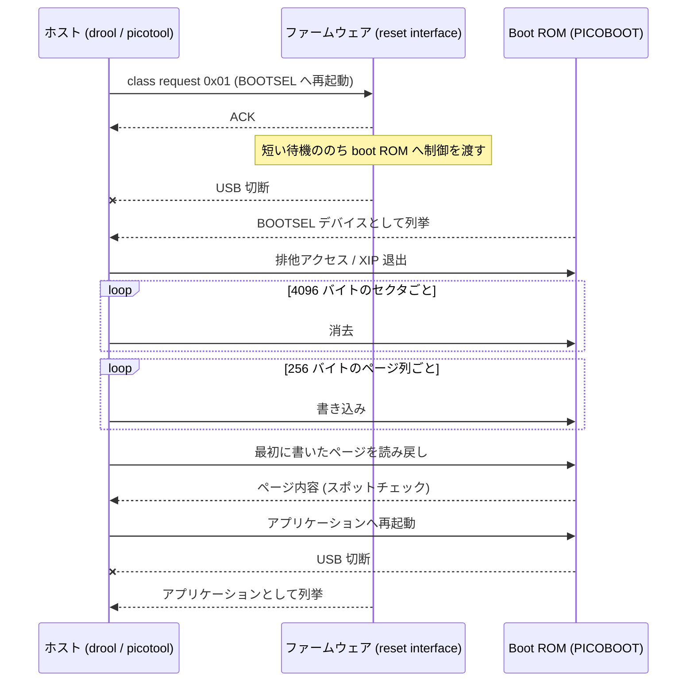
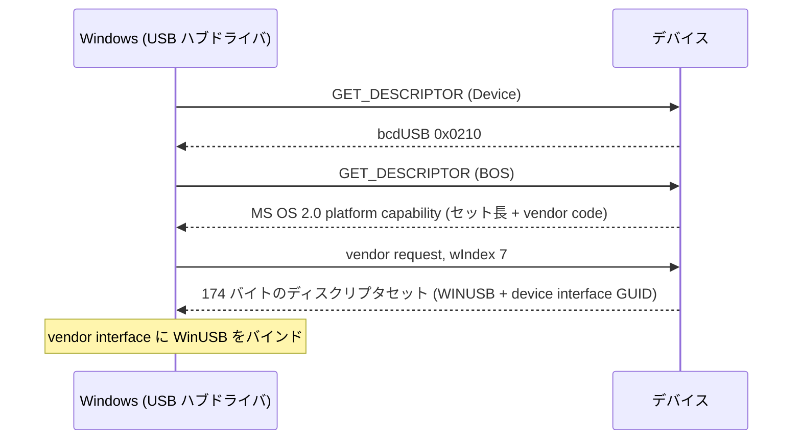

# 通信プロトコル

[English](PROTOCOL.md) | [日本語](PROTOCOL.jp.md)

実行中のボードを BOOTSEL へ再起動して書き込むとき、実際にワイヤ上を流れる
もの。振る舞いのレベルは [FLASHING.jp.md](FLASHING.jp.md)、デバイス側の
構成は [DESIGN.jp.md](DESIGN.jp.md) にある。

全体の流れ:

## reset interface

reset interface は class triple `FF/00/01`(vendor specific class、subclass
`0x00`、protocol `0x01`)で発見する。VID/PID は問わない — vendor id や
product id を手掛かりにしている箇所はないので、サードパーティ VID でも
そのまま動く。

そこへの要求は interface 宛の class request として送る:
`bmRequestType` は `0x21`、`wIndex` は interface 番号。`bRequest` は2つ:

| `bRequest` | 意味 |
|------------|------|
| `0x01` | BOOTSEL へ再起動 |
| `0x02` | アプリケーションへ再起動 |

### BOOTSEL 要求の `wValue`

`0x01` は引数を `wValue` に載せる(`src/protocol.rs`):

| ビット | 意味 |
|--------|------|
| 0-6 | interface disable マスク |
| 8 | GPIO アクティビティピンを指定する |
| 9-14 | GPIO ピン番号(ビット8が立っている場合) |

RP2040 では両フィールドがそのまま boot ROM の
`reset_to_usb_boot(gpio_activity_pin_mask, disable_interface_mask)` の引数に
対応する。ピン番号は `1 << pin` のマスクになる。

RP2350 ではファームウェアが代わりに boot ROM の reboot API を呼ぶ。
そちらでは disable マスクのビット0がマスストレージ interface を、ビット1が
PICOBOOT を無効化する。GPIO アクティビティピンは受け取った上で無視する —
RP2350 の ROM API にそのパラメータがないため。

これは `picotool reboot -f -u` が送るのと同じ要求で、`drool` は同じものを
`nusb` 経由で送る。

## Windows のドライババインド

そもそも Windows に BOS ディスクリプタを要求させるのが `bcdUSB` の
`0x0210`。BOS には MS OS 2.0 platform capability ディスクリプタが入って
いて、174 バイトのディスクリプタセットの存在と、それを取得するための
vendor request コードを告知する。Windows はその vendor request を
`wIndex` 7 で送ってセットを取得する。

ディスクリプタセットは `WINUSB` compatible ID と picotool の device
interface GUID `{bc7398c1-73cd-4cb7-98b8-913a8fca7bf6}` を含む。この2つが
揃うことで、Windows は Zadig も手動ドライバ導入もなしに vendor interface へ
WinUSB をバインドする。デバイス側の実装は `src/ms_os_20.rs`、取得要求への
応答は `src/picotool_reset.rs`。

## BOOTSEL フェーズ

reset 要求のあとファームウェアはもういない: boot ROM が自前の USB デバイス
として列挙され、PICOBOOT を話す。`drool`(`picoboot` クレート経由)も
picotool も同じ interface を駆動し、操作もどちらも同じ:

- 4096 バイトのセクタ単位で消去し、
- 256 バイトのページ単位で書き込み、
- 読み戻して検証し、
- アプリケーションへ再起動する。

`drool` の検証は全体比較ではなくスポットチェック: 最初に書き込んだ領域の
先頭 256 バイトのページを読み戻し、送ったものと比較する。転送1回分の
コストで、書き込みを ack したのに実際にはコミットしていないデバイスを
検出でき、中途半端に書けたイメージを実行時に発見する事態を避けられる。
