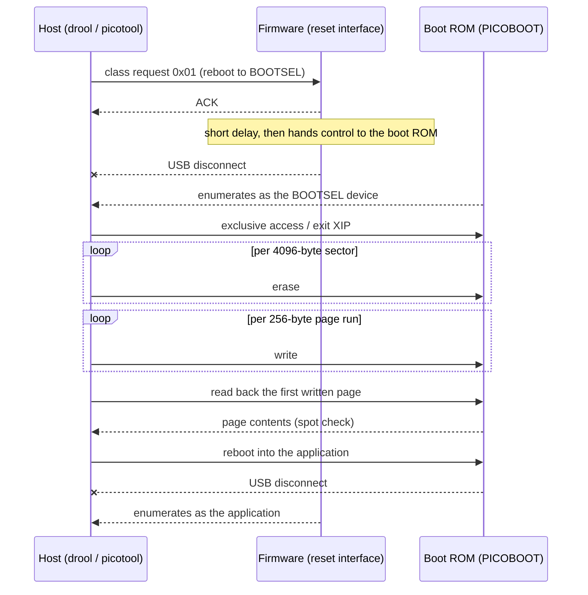
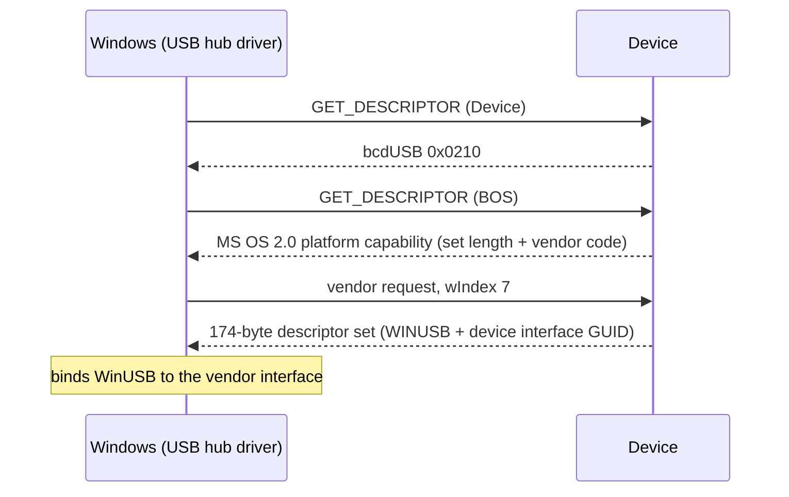

# Wire protocol

[English](PROTOCOL.md) | [日本語](PROTOCOL.jp.md)

What actually goes over the wire when a running board is rebooted into
BOOTSEL and reflashed. The behavior-level view is in
[FLASHING.md](FLASHING.md), the device-side structure in
[DESIGN.md](DESIGN.md).

The whole cycle at a glance:

## Reset interface

The reset interface is found by its class triple `FF/00/01`
(vendor-specific class, subclass `0x00`, protocol `0x01`) on any VID/PID —
nothing keys off the vendor or product id, so a third-party VID works
unchanged.

Requests to it are class requests addressed to the interface:
`bmRequestType` `0x21`, with `wIndex` set to the interface number. Two
`bRequest` values are defined:

| `bRequest` | Meaning |
|------------|---------|
| `0x01` | Reboot into BOOTSEL |
| `0x02` | Reboot into the application |

### `wValue` for the BOOTSEL request

`0x01` carries its arguments in `wValue` (`src/protocol.rs`):

| Bits | Meaning |
|------|---------|
| 0-6 | Interface disable mask |
| 8 | A GPIO activity pin is specified |
| 9-14 | The GPIO pin number, when bit 8 is set |

On RP2040 both fields map onto the boot ROM's
`reset_to_usb_boot(gpio_activity_pin_mask, disable_interface_mask)`
arguments; the pin number becomes a `1 << pin` mask.

On RP2350 the firmware calls the boot ROM's reboot API instead. There bit 0
of the disable mask disables the mass-storage interface and bit 1 disables
PICOBOOT, and the GPIO activity pin is accepted and ignored — the RP2350 ROM
API has no such parameter.

This is the same request `picotool reboot -f -u` sends; `drool` sends it
over `nusb`.

## Windows driver binding

`bcdUSB` of `0x0210` is what makes Windows ask for the BOS descriptor at
all. The BOS contains an MS OS 2.0 platform capability descriptor, which
announces a 174-byte descriptor set and the vendor request code that
retrieves it; Windows then fetches the set with that vendor request, using
`wIndex` 7.

The descriptor set carries the `WINUSB` compatible ID and picotool's device
interface GUID `{bc7398c1-73cd-4cb7-98b8-913a8fca7bf6}`. Those two together
are what makes Windows bind WinUSB to the vendor interface with no Zadig
and no manual driver install. The device side is `src/ms_os_20.rs`, and
`src/picotool_reset.rs` answers the fetch.

## BOOTSEL phase

After the reset request the firmware is gone: the boot ROM enumerates its
own USB device and speaks PICOBOOT. Both `drool` (through the `picoboot`
crate) and picotool drive that same interface, and the operations are the
same either way:

- erase in 4096-byte sectors,
- write in 256-byte pages,
- read back to verify,
- reboot into the application.

`drool`'s verification is a spot check rather than a full compare: it reads
back the first 256-byte page of the first written region and compares it
against what it sent. That costs one extra transfer and catches a device
that acknowledged the writes without committing them, instead of leaving a
half-written image to be discovered at runtime.
